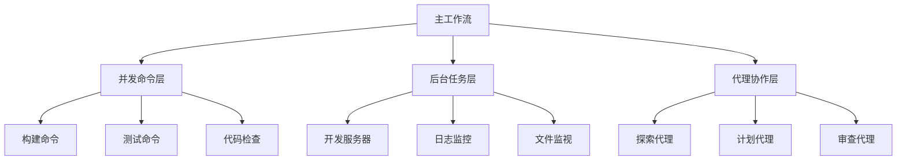

# 高级并行模式与优化技巧

## 并行执行架构

### 分层并行策略



### 1. 智能任务分派

#### 模式：根据任务类型选择执行策略

```python
# 伪代码：任务分派逻辑
def dispatch_task(task):
    if task.is_cpu_intensive():
        # CPU密集型：后台执行，定期检查
        return BackgroundTask(task)
    elif task.is_io_intensive():
        # IO密集型：并发执行
        return ConcurrentTask(task)
    elif task.needs_exploration():
        # 探索型：委托给代理
        return AgentTask(task, agent_type="Explore")
    elif task.is_critical():
        # 关键任务：主线程执行，实时监控
        return ForegroundTask(task)
```

#### WorkBuddy实现示例：
```bash
# 场景：同时处理构建、测试、文档生成
# CPU密集型：构建（后台）
Bash(command="npm run build --production", run_in_background=true)

# IO密集型：测试（并发）
Bash(command="npm run test:unit")
Bash(command="npm run test:integration")

# 探索型：代码质量分析（代理）
Agent(
    description="分析代码质量",
    subagent_type="Explore",
    prompt="查找代码异味和潜在bug"
)

# 关键任务：部署准备（主线程）
Bash(command="npm run bundle-analyze")
```

### 2. 上下文感知的并行调度

#### 模式：基于工作流阶段调整并行度

| 工作流阶段 | 推荐并行度 | 说明 |
|------------|------------|------|
| **初始化** | 低 | 环境检查、依赖安装，顺序执行避免冲突 |
| **开发** | 中高 | 构建、测试、开发服务器可并行 |
| **测试** | 高 | 单元测试、集成测试、端到端测试并行 |
| **部署** | 低 | 顺序部署确保稳定性 |

#### WorkBuddy实现：
```bash
# 阶段感知调度函数
function schedule_by_phase(phase):
    if phase == "init":
        # 顺序执行
        Bash(command="npm ci")
        Bash(command="git submodule update")
        Bash(command="cp .env.example .env")
    elif phase == "development":
        # 并行执行
        Bash(command="npm run dev", run_in_background=true)  # 开发服务器
        Bash(command="npm run type-check", run_in_background=true)  # 类型检查
        Bash(command="npm run lint:watch", run_in_background=true)  # 代码检查
    elif phase == "testing":
        # 高度并行
        Bash(command="npm run test:unit -- --maxWorkers=4")
        Bash(command="npm run test:integration")
        Bash(command="npm run test:e2e")
```

### 3. 资源感知的负载均衡

#### 模式：根据系统资源动态调整

```bash
# 检测系统资源
Bash(command="nproc")  # CPU核心数
Bash(command="free -h")  # 内存使用
Bash(command="df -h /")  # 磁盘空间

# 基于资源的并行决策
cpu_cores=$(nproc)
if [ $cpu_cores -ge 8 ]; then
    # 高资源：激进并行
    max_workers=8
    background_tasks=4
elif [ $cpu_cores -ge 4 ]; then
    # 中资源：适度并行
    max_workers=4
    background_tasks=2
else:
    # 低资源：保守并行
    max_workers=2
    background_tasks=1
```

### 4. 依赖感知的任务图

#### 模式：构建任务依赖关系图

```yaml
# 任务依赖定义
tasks:
  install_deps:
    command: "npm ci"
    
  build_core:
    command: "npm run build:core"
    depends_on: ["install_deps"]
    
  build_ui:
    command: "npm run build:ui"
    depends_on: ["install_deps"]
    
  run_tests:
    command: "npm run test"
    depends_on: ["build_core", "build_ui"]
    
  bundle:
    command: "npm run bundle"
    depends_on: ["run_tests"]
```

#### WorkBuddy实现（使用TaskCreate/TaskUpdate）：
```bash
# 创建任务并设置依赖
TaskCreate(subject="安装依赖", description="安装项目依赖", task_id="install")
TaskCreate(subject="构建核心", description="构建核心模块", task_id="build_core")
TaskCreate(subject="构建UI", description="构建UI组件", task_id="build_ui")
TaskCreate(subject="运行测试", description="执行测试套件", task_id="test")
TaskCreate(subject="打包", description="生成生产包", task_id="bundle")

# 设置依赖关系
TaskUpdate(task_id="build_core", addBlockedBy=["install"])
TaskUpdate(task_id="build_ui", addBlockedBy=["install"])
TaskUpdate(task_id="test", addBlockedBy=["build_core", "build_ui"])
TaskUpdate(task_id="bundle", addBlockedBy=["test"])
```

## 性能优化模式

### 1. 缓存策略

#### 模式：避免重复计算和文件操作

```bash
# 文件存在性检查缓存
if [ ! -f "node_modules/.cache/build.lock" ]; then
    Bash(command="npm run build")
    Bash(command="touch node_modules/.cache/build.lock")
else:
    echo "使用缓存构建"
fi

# 命令结果缓存
cache_key=$(echo "npm run lint" | md5sum | cut -d' ' -f1)
cache_file=".workbuddy/cache/${cache_key}.output"

if [ ! -f "$cache_file" ] || [ "$(find src -newer $cache_file)" ]; then
    # 缓存失效或源文件更新
    Bash(command="npm run lint > $cache_file")
fi

# 使用缓存结果
Read(file_path="$cache_file")
```

### 2. 增量处理

#### 模式：仅处理变更部分

```bash
# Git变更感知构建
changed_files=$(git diff --name-only HEAD~1 HEAD)

if echo "$changed_files" | grep -q "\.tsx\?$"; then
    Bash(command="npm run type-check -- --files $changed_files")
fi

if echo "$changed_files" | grep -q "\.scss$"; then
    Bash(command="npm run build:styles")
fi
```

### 3. 惰性执行

#### 模式：按需执行，避免不必要工作

```bash
# 条件执行示例
needs_build=false

# 检查是否需要构建
if [ ! -d "dist" ] || [ "package.json" -nt "dist" ]; then
    needs_build=true
fi

if [ "$needs_build" = true ]; then
    Bash(command="npm run build")
else:
    echo "跳过构建，使用现有dist"
fi
```

## 复杂工作流模式

### 1. 管道式数据流

```bash
# Codex CLI风格管道迁移
# 原命令：cat data.json | codex "分析并生成报告" | tee report.md

# WorkBuddy实现：
# 步骤1：读取数据
Read(file_path="data.json")

# 步骤2：分析数据（AI处理）
# [用户提供分析请求]

# 步骤3：生成报告
Write(file_path="report.md", content="[生成的报告内容]")

# 步骤4：并行验证
Bash(command="markdownlint report.md")  # 格式检查
Bash(command="wc -w report.md")  # 统计字数
```

### 2. 故障恢复模式

```bash
# 弹性执行策略
max_retries=3
timeout_seconds=30

for i in $(seq 1 $max_retries); do
    echo "尝试 $i/$max_retries..."
    
    # 执行命令，带超时
    result=$(Bash(command="flaky_command", timeout=timeout_seconds*1000))
    
    if [ $? -eq 0 ]; then
        echo "成功!"
        break
    else:
        echo "失败，等待重试..."
        sleep 5
        
        # 指数退避
        timeout_seconds=$((timeout_seconds * 2))
    fi
done

if [ $i -eq $max_retries ]; then
    echo "所有重试失败，需要人工干预"
fi
```

### 3. 实时监控与反馈

```bash
# 多源监控仪表板
# 启动多个监控源
Bash(command="tail -f logs/app.log", run_in_background=true)
Bash(command="docker stats", run_in_background=true)
Bash(command="npm run type-check -- --watch", run_in_background=true)

# 定期聚合报告
while true; do
    # 收集各监控源状态
    app_log_status=$(Bash(command="tail -5 logs/app.log | grep -c ERROR"))
    docker_status=$(Bash(command="docker ps --format 'table {{.Names}}\t{{.Status}}'"))
    type_check_status=$(Bash(command="test -f .tsc-output && cat .tsc-output || echo 'OK'"))
    
    # 生成综合报告
    report="### 系统状态报告 $(date)
    
    **应用日志错误**: $app_log_status 个ERROR
    
    **容器状态**:
    $docker_status
    
    **类型检查**: $type_check_status"
    
    # 保存报告
    Write(file_path="status_report.md", content="$report")
    
    # 等待下一轮
    sleep 60
done
```

## 迁移评估模式

### 1. 性能基准测试

```bash
# 迁移前后对比脚本
echo "### Codex CLI 基准测试"
time codex "生成100行Python代码" > /dev/null

echo "### WorkBuddy 基准测试"
# 测量WorkBuddy响应时间
start_time=$(date +%s%N)
# [执行WorkBuddy请求]
end_time=$(date +%s%N)
echo "耗时: $((($end_time-$start_time)/1000000)) 毫秒"

# 比较指标
echo "### 比较结果"
echo "- 速度差异: X%"
echo "- 准确性: Y%"
echo "- 功能完整性: Z%"
```

### 2. 用户体验评估

```yaml
# 评估维度
评估指标:
  - 学习曲线: "低/中/高"
  - 生产力增益: "百分比"
  - 错误率: "迁移前后对比"
  - 上下文保持: "会话记忆能力"
  - 集成度: "与现有工具链整合"

数据收集:
  - 用户反馈调查
  - 使用日志分析
  - A/B测试结果
  - 性能监控数据
```

## 最佳实践总结

### 并行设计原则
1. **最小耦合**：并行任务尽量独立，减少共享状态
2. **明确边界**：清晰定义任务输入输出接口
3. **优雅降级**：并行失败时能回退到顺序执行
4. **资源限额**：设置并发上限，避免系统过载
5. **监控可见**：所有并行任务状态可追踪

### 迁移优化原则
1. **渐进迁移**：先边缘后核心，先简单后复杂
2. **性能监控**：持续测量迁移效果
3. **回滚准备**：保留原有工作流作为备份
4. **用户培训**：提供逐步适应指南
5. **持续改进**：基于使用反馈迭代优化

### 工具链集成原则
1. **标准化接口**：定义清晰的工作流API
2. **插件化架构**：支持扩展和定制
3. **配置即代码**：工作流定义可版本控制
4. **文档自动化**：工作流自动生成文档
5. **测试覆盖**：并行工作流纳入CI/CD

---

*这些高级模式需要根据具体项目需求调整。建议从小规模试点开始，逐步应用复杂模式。*