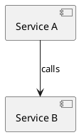
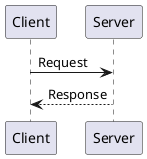
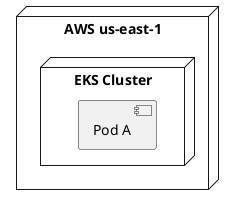
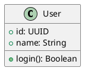
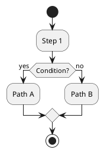
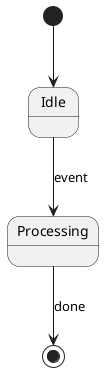
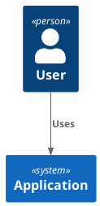

# PlantUML Diagram Types

Quick reference for choosing the right diagram type.

## Component Diagram (Architecture — DEFAULT)

**Use for:** System architecture, component relationships, layered systems, package structure.

**Keywords:** `component`, `interface`, `package`, `node`, `cloud`
**Relationship arrows:** `-->` (solid), `..>` (dependency), `..` (context)
**Grouping:** `package "Name" { }`

---

## Sequence Diagram (Interactions Over Time)

**Use for:** API call flows, protocol exchanges, authentication flows, message passing.

**Keywords:** `participant`, `actor`, `database`, `boundary`, `control`, `entity`
**Arrow types:** `->` (sync), `-->` (async), `->>` (async message), `-x` (lost)

---

## Deployment Diagram (Infrastructure)

**Use for:** Physical/virtual infrastructure, containers, VMs, cloud topology.

**Keywords:** `node`, `cloud`, `database`, `storage`, `frame`

---

## Class Diagram (Object Structure)

**Use for:** Class hierarchies, data models, entity relationships, interfaces.

**Keywords:** `class`, `interface`, `abstract`, `enum`, `package`

---

## Activity Diagram (Workflows)

**Use for:** Business processes, workflows, decision trees, pipelines.

**Keywords:** `start`, `stop`, `:step;`, `if`/`else`/`endif`, `repeat`, `fork`

---

## State Diagram (State Machines)

**Use for:** Object lifecycle, state transitions, device states.

**Keywords:** `state`, `[*]` (start/end), `-->` (transition)

---

## C4 Model (via Standard Library)

**Use for:** C4 architecture modeling (Context, Container, Component, Code).

**Keywords:** `Person()`, `System()`, `Container()`, `Rel()`, `BiRel()`

---

## Decision Matrix

| I need to show... | Use |
|---|---|
| How systems connect and depend on each other | Component Diagram |
| The order of API calls or messages | Sequence Diagram |
| What runs on which server/node | Deployment Diagram |
| Data model or class hierarchy | Class Diagram |
| A business workflow with decisions | Activity Diagram |
| How something changes states | State Diagram |
| High-level context (who uses what) | C4 Context |
